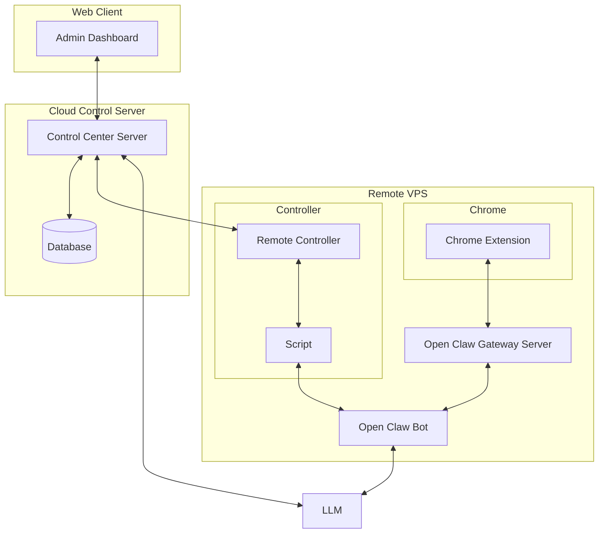

# Current situation

There are numerous remote VPS where Chrome is installed. Currently, operators manually log into these VPS, open Chrome, and perform various tasks. This process is time-consuming and inefficient.

# The goal of the system

The goal of the system is to automate the management of remote VPS and Chrome instances. The system will allow operators to control and monitor their VPS and Chrome instances remotely through a web interface. This will save time and increase efficiency by eliminating the need for manual logins and interactions with the VPS.

# Architectural Overview

1. Remote VPS is controlled through the Remote Controller, which is essentially a NodeJS server running on the VPS. This server manages the Chrome instances and communicates with the Open Claw Bot.
2. The Open Claw Bot is responsible for executing commands received from the Remote Controller and interacting with the Chrome instances. It can perform tasks such as opening websites, clicking buttons, and extracting data.
3. The Open Claw Gateway Server acts as a bridge between the Chrome Extension and the Open Claw Bot. It receives commands from the Chrome Extension and forwards them to the Open Claw Bot, and vice versa.
4. The Control Center Server is the central hub for managing all Remote Controllers and Open Claw Bots. It provides an interface for operators to monitor and control their VPS and Chrome instances. It also stores data in a database for tracking and analytics purposes.
5. The Admin Dashboard is a web interface that allows operators to interact with the Control Center Server. Through this dashboard, operators can view the status of their VPS and Chrome instances, send commands, and analyze data.
6. The Control Center Server and Admin Dashboard is a single full-stack application built with NextJS, which provides a seamless user experience for managing the system.
7. The database is a MongoDB instance hosted on MongoDB Atlas, which provides a scalable and reliable solution for storing data related to the VPS, Chrome instances, and user interactions.

